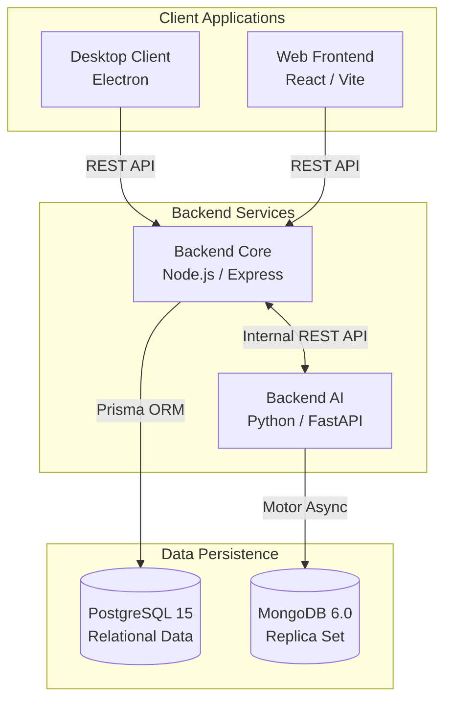

# CIRA: Secure Desktop Examination Application

## 1. Executive Summary

CIRA is a comprehensive educational assessment platform designed to facilitate secure examinations, automated grading, and advanced analytics. The application operates across multiple interfaces (a web portal and a secure desktop client) and is supported by a dual-backend architecture. It leverages a traditional Node.js/Express server for standard business logic and a dedicated Python/FastAPI service for Artificial Intelligence and Natural Language Processing tasks.

## 2. System Architecture

The system utilizes a microservices-inspired architecture to separate standard data processing from computationally intensive AI tasks. 

### Architecture Flow
1. **User Interaction**: Administrators, faculty, and students interact via the Web Frontend. During an examination, students are restricted to the Desktop Client to ensure a secure, anti-cheat environment.
2. **Core Processing**: The Web Frontend and Desktop Client communicate directly with the Backend Core. The Backend Core handles authentication, authorization, and standard CRUD operations.
3. **AI Offloading**: When operations require complex processing (e.g., auto-grading a subjective assignment or running predictive analytics), the Backend Core acts as a proxy and sends a request to the Backend AI.
4. **Data Storage**: Relational data (users, roles, departments, exam schedules) is stored securely in PostgreSQL. Document-based or high-throughput data required by the AI models is managed via the MongoDB Replica Set.

## 3. Detailed Component Breakdown

### 3.1. Infrastructure and Deployment
**Directory**: `/` (Project Root)
* `docker-compose.yml`: Orchestrates the database infrastructure. It initializes the `postgres` container for relational data and a three-node MongoDB replica set (`mongo1`, `mongo2`, `mongo3`) required for advanced MongoDB features such as transactions and change streams.
* `README.md`: This documentation file.
* `Product Requirements Document CIRA.pdf / .docx`: Official product specification and requirement outlines.

### 3.2. Backend Core
**Directory**: `/backend-core`
**Tech Stack**: Node.js, Express, TypeScript, Prisma ORM.
**Purpose**: Serves as the primary API gateway and business logic handler.

* `package.json` & `tsconfig.json`: Configuration and dependency definitions.
* `prisma/schema.prisma`: The central database schema. Defines models such as `User`, `Department`, `Section`, `Quiz`, `Assignment`, and `Result`.
* `src/index.ts` & `src/app.ts`: Entry points for the application, responsible for initializing the Express server and binding middlewares.
* `src/controllers/`: Contains the business logic for specific domains.
  * `auth.controller.ts`: Manages user login, registration, and JWT issuance.
  * `admin.controller.ts`: Functions for system administrators to manage the platform hierarchy.
  * `faculty.controller.ts`: Logic for teachers to create assignments and quizzes.
  * `exam.controller.ts`: Manages the state and submission of ongoing examinations.
  * `analytics.controller.ts`: Aggregates performance metrics.
* `src/routes/`: Maps HTTP endpoints to their respective controllers.
* `src/middlewares/`: Houses interceptors (e.g., JWT validation, role-based access control, error handling).

### 3.3. Backend AI
**Directory**: `/backend-ai`
**Tech Stack**: Python, FastAPI, Motor, Sentence-Transformers, Scikit-Learn.
**Purpose**: A microservice dedicated to data science, natural language processing, and machine learning.

* `requirements.txt`: Python package dependencies.
* `src/main.py`: The FastAPI application entry point.
* `src/services/`: Core logic for AI computations.
  * `nlp_service.py`: Leverages `sentence-transformers` for natural language processing, enabling subjective answer grading, semantic similarity analysis, and plagiarism detection.
  * `assignment_service.py`: Automates assignment evaluation and provides intelligent feedback structures.
  * `analytics_service.py`: Applies `scikit-learn` algorithms to process complex student performance metrics and generate predictive insights.
* `src/routes/` & `src/controllers/`: API endpoints exposed internally to the Backend Core.
* `src/schemas/`: Pydantic models for data validation and serialization.

### 3.4. Web Frontend
**Directory**: `/frontend-web`
**Tech Stack**: React 19, TypeScript, Vite, Tailwind CSS.
**Purpose**: The universal web portal for all non-examination activities.

* `vite.config.ts`: Configuration for the Vite build tool.
* `tailwind.config.js`: Utility-first CSS configuration and theme definitions.
* `src/main.tsx` & `src/App.tsx`: Application bootstrap, layout definitions, and routing context.
* `src/pages/`: Main application views.
  * `LandingPage.tsx`: The public-facing entry point.
  * `Login.tsx`: User authentication view.
  * `AdminDashboard.tsx`: Administrative interface for system oversight.
  * `FacultyDashboard.tsx`: Dashboard for educators to construct assessments and view metrics.
  * `StudentDashboard.tsx`: Interface for students to track schedules, past results, and pending assignments.
* `src/components/`: Modular, reusable React components (e.g., navigation bars, modals, charts leveraging `recharts`).

### 3.5. Desktop Client
**Directory**: `/desktop-client`
**Tech Stack**: Electron, HTML/JS.
**Purpose**: A lockdown examination browser ensuring integrity during testing.

* `package.json`: Electron application configuration.
* `main.js`: The primary Electron process. It instantiates the application window and enforces security protocols (e.g., disabling secondary displays, blocking keyboard shortcuts, and preventing screen capture).
* `preload.js`: A secure context bridge that selectively exposes native OS functionalities to the renderer process without compromising security.
* `index.html`: The user interface renderer that loads the examination environment and communicates securely with the Backend Core.

## 4. Data Flow and Integration Points

1. **Authentication Flow**: A user logs into the Web Frontend or Desktop Client. The request hits `backend-core/src/controllers/auth.controller.ts`. A JWT is generated and returned for subsequent requests.
2. **Assessment Creation**: Faculty use the `FacultyDashboard.tsx` to create a quiz. The Web Frontend sends a POST request to `backend-core`, which utilizes Prisma to store the assessment in PostgreSQL.
3. **Examination Execution**: A student uses the Electron `desktop-client`. The application locks the system and fetches assessment details from `backend-core`. Answers are submitted continuously or at the end of the session.
4. **AI Evaluation**: Upon submission of subjective content, `backend-core` sends an internal request to `backend-ai`. The `nlp_service.py` evaluates the content, compares it against rubric benchmarks, and returns a calculated score and feedback.
5. **Analytics Generation**: Faculty request performance metrics via the Web Frontend. `backend-core` may query `backend-ai`'s `analytics_service.py` to aggregate historical data stored in MongoDB, passing the synthesized metrics back to the frontend for visualization via `recharts`.